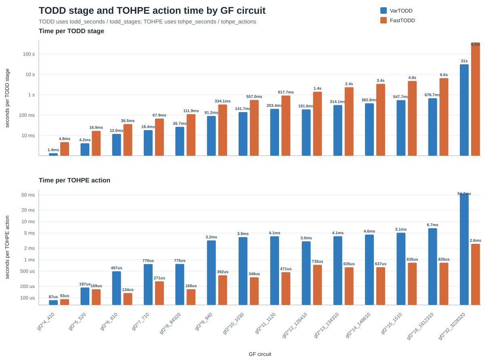
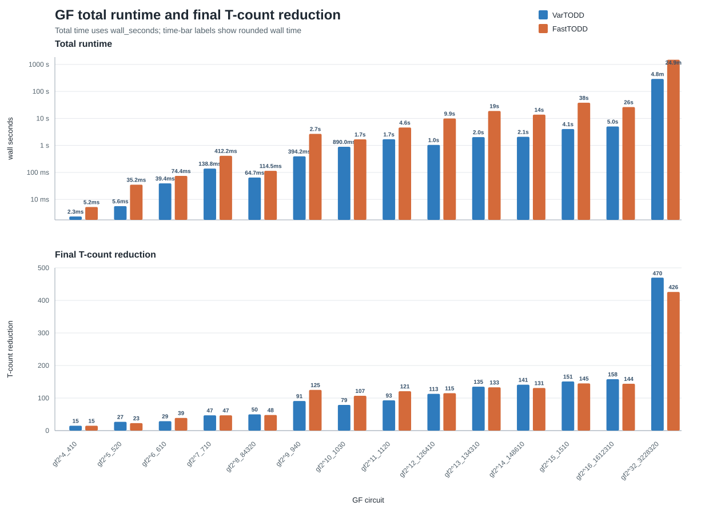

# GF VarTODD vs FastTODD Benchmark

This benchmark compares two optimizers on the same GF phase-polynomial matrices:

- `vartodd_fasttodd_mimic.py`: VarTODD C++ `policy_iteration` driven in the FastTODD outer loop shape, mimicking FastTODD's policy and action-generation structure.
- `bench_fasttodd_stages`: the Rust FastTODD implementation from `quantum-circuit-optimization`, with added stage timing.

Default GF instances:

```text
4   data/init_npy/gf_mult_Vandaele_wo_ancilla/gf2^4_410.npy
5   data/init_npy/gf_mult_Vandaele_wo_ancilla/gf2^5_520.npy
6   data/init_npy/gf_mult_Vandaele_wo_ancilla/gf2^6_610.npy
7   data/init_npy/gf_mult_Vandaele_wo_ancilla/gf2^7_710.npy
8   data/init_npy/gf_mult_Vandaele_wo_ancilla/gf2^8_84320.npy
9   data/init_npy/gf_mult_Vandaele_wo_ancilla/gf2^9_940.npy
10  data/init_npy/gf_mult_Vandaele_wo_ancilla/gf2^10_1030.npy
16  data/init_npy/gf_mult_Vandaele_wo_ancilla/gf2^16_1612310.npy
32  data/init_npy/gf_mult_Vandaele_wo_ancilla/gf2^32_3228320.npy
64  data/init_npy/gf_mult_Vandaele_wo_ancilla/gf2^64_644310.npy
```

Run the full comparison from the repo root:

```bash
nix-shell --run 'bash scripts/benchmarks/run_gf_comparison.sh'
```

Run a subset:

```bash
nix-shell --run 'DIMS="4 5 6" OUT=/tmp/gf_subset.csv bash scripts/benchmarks/run_gf_comparison.sh'
```

CSV columns:

```text
algorithm,circuit,initial_t_count,final_t_count,wall_seconds,tohpe_seconds,todd_seconds,stages,tohpe_stages,todd_stages,tohpe_actions,todd_actions,phase_polynomials
```

Stage semantics:

- `stages`: FastTODD outer-loop iterations.
- `tohpe_stages`: number of TOHPE local-convergence phases.
- `todd_stages`: number of full TODD scans.
- `tohpe_actions`: successful TOHPE reductions applied inside all TOHPE phases.
- `todd_actions`: successful full TODD reductions applied after TODD scans.
- `tohpe_seconds` and `todd_seconds`: accumulated time inside those phases; `wall_seconds` includes loader and orchestration overhead.

## Current Comparison Plots

The stage-time plot compares TODD seconds per stage against TOHPE seconds per action. The bar labels are rounded durations; exact timings, iteration counts, and action counts remain in the SVG hover titles.



The summary plot compares total wall time and final T-count reduction. The time bars are labeled with rounded wall times.



Regenerate both plots from the repo root:

```bash
python scripts/benchmarks/plot_gf_todd_stage_time.py --csv benchmark_results/gf_comparison.csv
```
